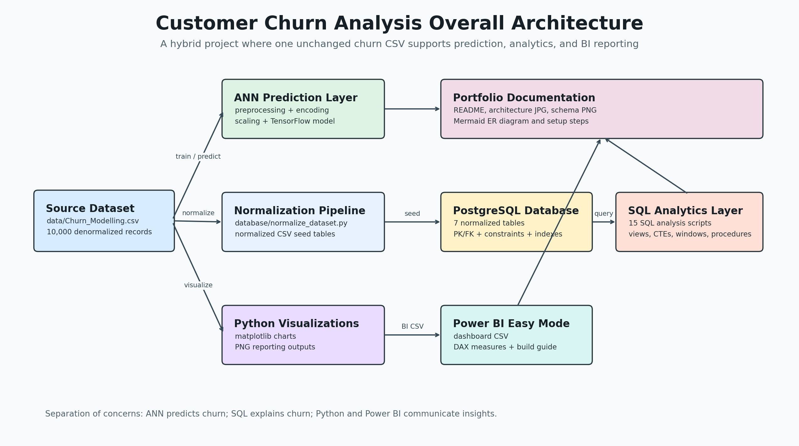
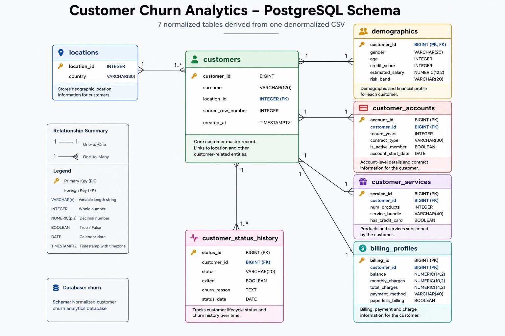

# Customer Churn Analysis

Hybrid **SQL analytics + ANN churn prediction** project built from one denormalized customer churn CSV.



## Overall Architecture

The project uses one unchanged source CSV and separates responsibilities across three workflows:

- **ANN prediction** uses the original dataset for preprocessing, encoding, scaling, training, and churn prediction.
- **SQL analytics** normalizes the same dataset into PostgreSQL tables for BI queries and business analysis.
- **Reporting assets** use Python-generated charts and a Power BI easy-mode dataset to communicate churn insights.



## Project Purpose

This repository contains two separate layers that solve different problems:

1. **ANN Prediction Layer**
   - Handles preprocessing, encoding, scaling, model training, and churn prediction.
   - Uses the original denormalized CSV so the machine learning pipeline stays intact.

2. **SQL Analytics Layer**
   - Converts the single CSV into a normalized PostgreSQL-style relational model.
   - Supports business intelligence, churn analysis, revenue analysis, retention reporting, segmentation, and dashboarding.

The SQL layer does **not** replace the ANN pipeline. It is an independent analytics and reporting layer.

## Repository Structure

```text
ANN/
  ann.ipynb
  model_trainer.ipynb
  models/
    ann_model.h5
    onehot_encoder.pkl
    standard_scaler.pkl

data/
  Churn_Modelling.csv
  normalized/
    accounts.csv
    billing.csv
    customers.csv
    customer_status_history.csv
    demographics.csv
    locations.csv
    services.csv

database/
  normalize_dataset.py
  schema.sql
  constraints.sql
  indexes.sql
  seed.sql

sql/
  01_customer_overview.sql
  02_customer_segmentation.sql
  03_churn_analysis.sql
  04_retention_analysis.sql
  05_cohort_analysis.sql
  06_revenue_analysis.sql
  07_customer_lifetime_value.sql
  08_contract_analysis.sql
  09_payment_analysis.sql
  10_service_analysis.sql
  11_views.sql
  12_stored_procedures.sql
  13_window_functions.sql
  14_cte_examples.sql
  15_business_questions.sql

visualizations/
  python/
  powerbi/

docs/
  er_diagram.md

sql_schema.png
requirements.txt
README.md
```

## Dataset

The original dataset is kept unchanged at:

```text
data/Churn_Modelling.csv
```

It contains 10,000 customer records with fields such as:

- Customer ID and surname
- Credit score
- Geography
- Gender and age
- Tenure
- Balance
- Number of products
- Credit card ownership
- Active membership status
- Estimated salary
- Churn target column: `Exited`

## ANN Prediction Layer

The ANN module is located in:

```text
ANN/
```

It contains:

- `ANN/ann.ipynb`: ANN experimentation and churn prediction notebook
- `ANN/model_trainer.ipynb`: model training notebook
- `ANN/models/ann_model.h5`: saved neural network model
- `ANN/models/onehot_encoder.pkl`: saved encoder
- `ANN/models/standard_scaler.pkl`: saved scaler

The ANN layer is responsible for:

- Loading the original CSV
- Feature selection
- Label encoding
- One-hot encoding
- Train-test split
- Feature scaling
- Neural network training
- Churn prediction

The notebooks were only adjusted for the reorganized file path:

```text
../data/Churn_Modelling.csv
```

## SQL Analytics Layer

The SQL layer designs a normalized relational model from the single CSV. It contains **7 normalized tables**:

| Table | Purpose |
| --- | --- |
| `locations` | Geography reference table |
| `customers` | Core customer identity table |
| `demographics` | Gender, age, credit score, salary, and risk band |
| `customer_accounts` | Tenure, contract type, active-member status |
| `customer_services` | Product count, service bundle, credit card ownership |
| `billing_profiles` | Balance, charges, payment method, billing attributes |
| `customer_status_history` | Retained/churned status and churn history |

The schema includes:

- Primary keys
- Foreign keys
- Unique constraints
- Check constraints
- Generated columns
- Useful indexes
- PostgreSQL-compatible datatypes

Main schema files:

```text
database/schema.sql
database/constraints.sql
database/indexes.sql
database/seed.sql
```

The ER diagram is available in two forms:

- Root image: `sql_schema.png`
- Mermaid documentation: `docs/er_diagram.md`

## Normalization Pipeline

The project starts from one denormalized CSV and generates relational seed files.

Run:

```bash
python database/normalize_dataset.py
```

This creates:

```text
data/normalized/accounts.csv
data/normalized/billing.csv
data/normalized/customers.csv
data/normalized/customer_status_history.csv
data/normalized/demographics.csv
data/normalized/locations.csv
data/normalized/services.csv
```

## PostgreSQL Setup

Create a PostgreSQL database, then run these scripts from the repository root:

```bash
psql -d your_database_name -f database/schema.sql
psql -d your_database_name -f database/constraints.sql
psql -d your_database_name -f database/indexes.sql
psql -d your_database_name -f database/seed.sql
```

Recommended SQL setup order after loading tables:

```bash
psql -d your_database_name -f sql/11_views.sql
psql -d your_database_name -f sql/12_stored_procedures.sql
```

Then run any analysis scripts in `sql/`.

## SQL Analytics Scripts

The `sql/` folder contains 15 portfolio-style analytics scripts:

- Customer overview
- Customer segmentation
- Churn analysis
- Retention analysis
- Cohort analysis
- Revenue analysis
- Customer lifetime value
- Contract analysis
- Payment analysis
- Service analysis
- Views and materialized views
- Stored procedures and functions
- Window function examples
- CTE and recursive CTE examples
- Business question answers

The SQL demonstrates:

- CTEs
- Recursive CTEs
- Window functions
- Ranking and dense ranking
- Lead and lag
- Percentiles
- Views
- Materialized views
- Stored procedures/functions
- CASE statements
- Aggregations
- Subqueries
- Correlated subqueries
- `EXISTS`
- `HAVING`
- Complex joins

`sql/11_views.sql` includes `vw_ann_training_dataset`, which reconstructs the ANN training dataset shape from the normalized database if a SQL-backed ML workflow is needed later.

## Python Visualizations

Python visualization files are in:

```text
visualizations/python/
```

Run:

```bash
python visualizations/python/generate_visualizations.py
```

Generated charts are saved in:

```text
visualizations/python/outputs/
```

Included visuals:

- Churn distribution
- Churn rate by geography
- Churn rate by contract type
- Churn by age band
- Credit score vs balance
- Revenue-at-risk segments

These are business-reporting visuals only and do not affect the ANN pipeline.

## Power BI Easy Mode

Power BI assets are in:

```text
visualizations/powerbi/
```

Use this CSV in Power BI Desktop:

```text
visualizations/powerbi/customer_churn_powerbi_easy_mode.csv
```

The file is a flat dashboard-ready dataset generated from the source CSV. It includes extra reporting columns such as:

- `AgeBand`
- `ContractType`
- `PaymentMethod`
- `MonthlyCharges`
- `AnnualRevenueAtRisk`
- `ChurnStatus`

Power BI measures are provided in:

```text
visualizations/powerbi/measures.dax
```

Use the guide in:

```text
visualizations/powerbi/README.md
```

This Power BI setup is intentionally simple: one CSV import table, DAX measures, and dashboard instructions.

## Install Dependencies

```bash
pip install -r requirements.txt
```

Main Python libraries:

- pandas
- numpy
- matplotlib
- scikit-learn
- tensorflow
- Flask-related serving dependencies

## End-to-End Workflow

1. Install dependencies.
2. Run or inspect the ANN notebooks in `ANN/`.
3. Generate normalized seed files with `database/normalize_dataset.py`.
4. Load the PostgreSQL schema, constraints, indexes, and seed files.
5. Run SQL analytics scripts from `sql/`.
6. Generate Python charts from `visualizations/python/`.
7. Import the Power BI easy-mode CSV into Power BI Desktop.

## Key Business Questions Answered

- What is the overall churn rate?
- Which payment methods have the highest churn?
- Which contract types are most vulnerable?
- Which geography has the highest churn?
- Which demographic segments are highest risk?
- What is the estimated revenue lost due to churn?
- Which customers have the highest lifetime value?
- Which segments should retention teams prioritize?
- How does churn vary by tenure, age band, and service bundle?

## Important Design Note

The ANN and SQL layers are deliberately separated:

- ANN predicts churn.
- SQL explains churn from a business analytics perspective.
- Python and Power BI visuals communicate churn insights.
