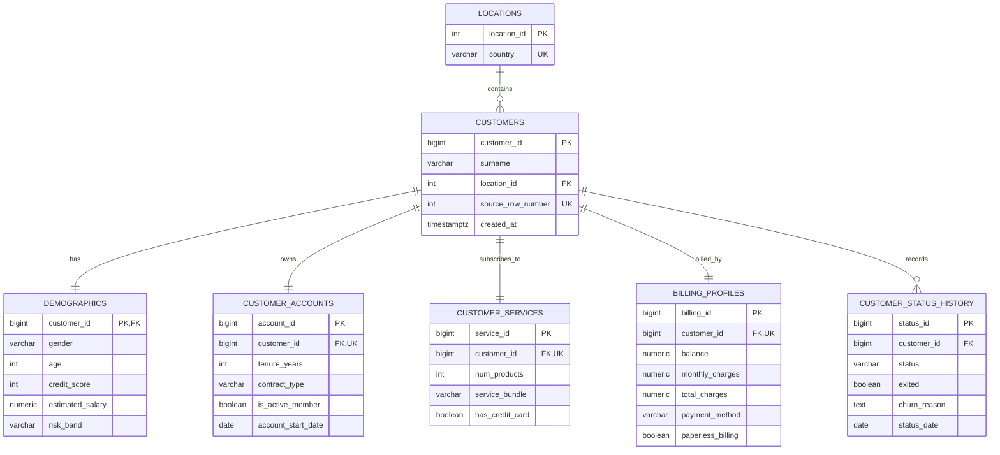

# Normalized Churn Database ER Diagram

```mermaid
erDiagram
    LOCATIONS ||--o{ CUSTOMERS : contains
    CUSTOMERS ||--|| DEMOGRAPHICS : has
    CUSTOMERS ||--|| CUSTOMER_ACCOUNTS : owns
    CUSTOMERS ||--|| CUSTOMER_SERVICES : subscribes_to
    CUSTOMERS ||--|| BILLING_PROFILES : billed_by
    CUSTOMERS ||--o{ CUSTOMER_STATUS_HISTORY : records

    LOCATIONS {
        int location_id PK
        varchar country UK
    }

    CUSTOMERS {
        bigint customer_id PK
        varchar surname
        int location_id FK
        int source_row_number UK
        timestamptz created_at
    }

    DEMOGRAPHICS {
        bigint customer_id PK,FK
        varchar gender
        int age
        int credit_score
        numeric estimated_salary
        varchar risk_band
    }

    CUSTOMER_ACCOUNTS {
        bigint account_id PK
        bigint customer_id FK,UK
        int tenure_years
        varchar contract_type
        boolean is_active_member
        date account_start_date
    }

    CUSTOMER_SERVICES {
        bigint service_id PK
        bigint customer_id FK,UK
        int num_products
        varchar service_bundle
        boolean has_credit_card
    }

    BILLING_PROFILES {
        bigint billing_id PK
        bigint customer_id FK,UK
        numeric balance
        numeric monthly_charges
        numeric total_charges
        varchar payment_method
        boolean paperless_billing
    }

    CUSTOMER_STATUS_HISTORY {
        bigint status_id PK
        bigint customer_id FK
        varchar status
        boolean exited
        text churn_reason
        date status_date
    }
```
